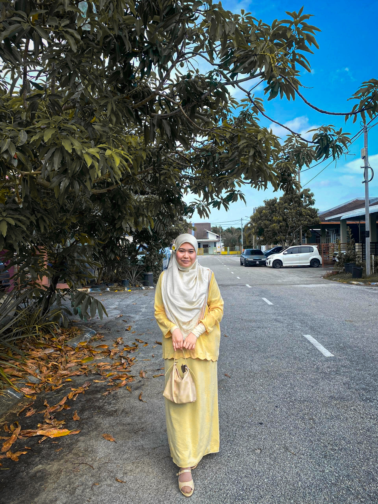

<html>
<head>
    <meta charset="UTF-8">
    <meta name="viewport" content="width=device-width, initial-scale=1.0">
    <title>Happy Birthday Nasahhara !</title>
    
</head>
<body>
    <h1>Happy Birthday, Nasahhara!</h1>
    
Wishing you all the love, joy, and happiness in the world today and always. You mean so much to me! Semoga awak sentiasa dilindungi dan diluaskan rezeki dari Allah s.w.t. Jadi anak yang baik dan solehah yaa..

    

        
        
    

    <a href="FB_VID_3300536119473816444.mp4" class="button">Your Special Gift</a>
</body>
</html>
